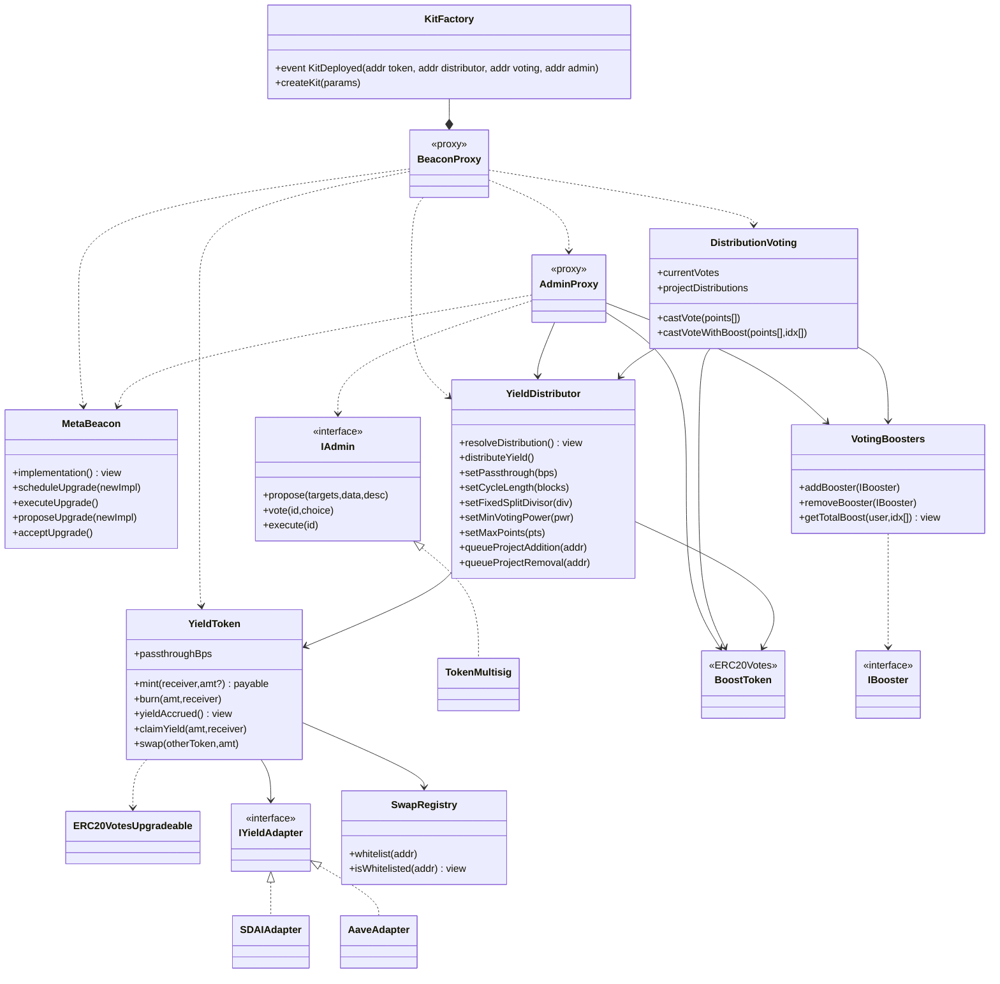
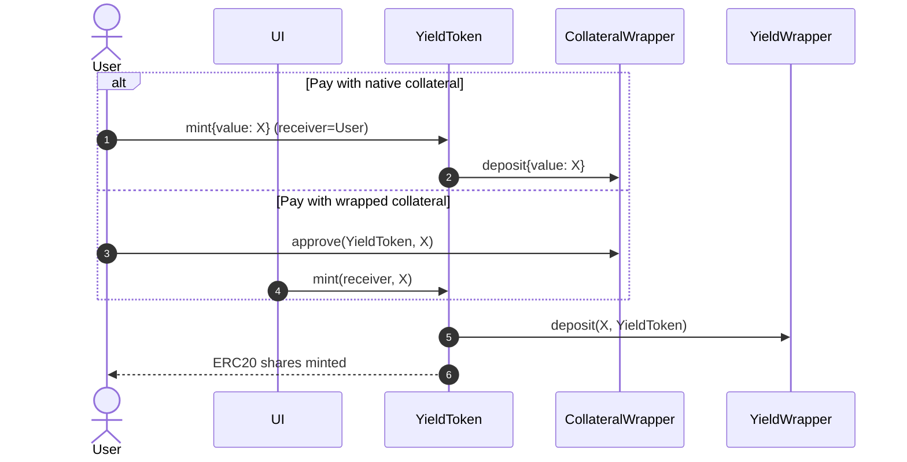
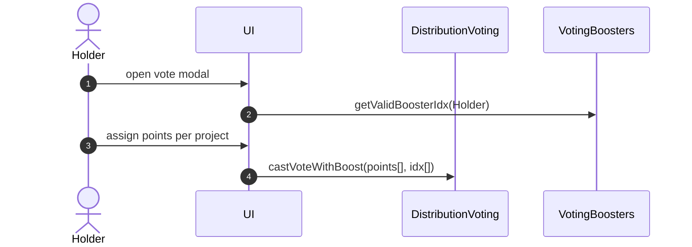
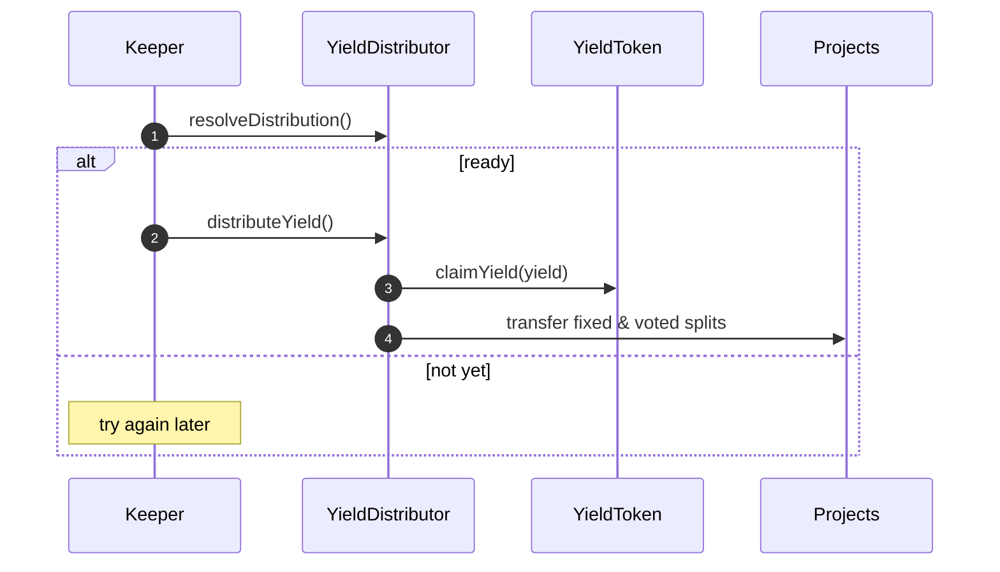
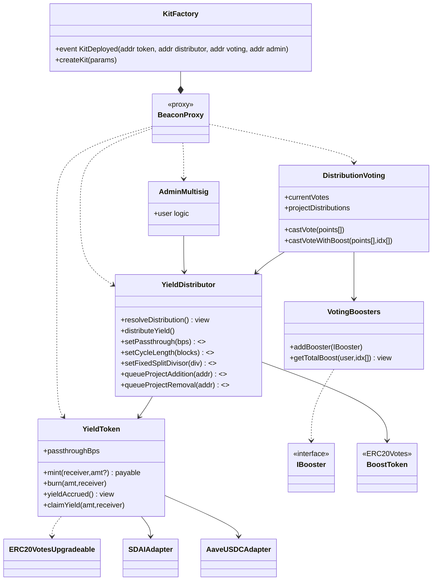

# Introduction  
### Why Bread Kit?

BREAD is great. So great that many orgs have reached out to us wanting their own version. Bread Kit is our answer: a permissionless factory so anyone can deploy their own version of BREAD (basic front end included) with custom governance features, branding, and choice between many different yield distribution mechanisms. Bread Kit hands every collective the recipe for its own yield-powered currency, accelerating the flow of resources toward public goods and communities without needing to know how to code. 

This spec covers the full vision of Bread Kit. Many of these features may be far off in the future but are important to think about when designing the MVP. 

### Overview of New Features:

### Chose Yield Source 

Select between yield sources like sDAI, aave lending pools, curve USDC, etc

### New Governance Mechanisms

Select between predefined gov mechanisms like the one BREAD currently uses and governance mechanisms discovered through consumer research. Also, make it easy to swap in custom governor for deciding member projects, yield split, and updating parameters (ex. calling the setter function for epoch length). In my personal opinion, the full version of bread kit should allow for deployed controlled through the community governance, not an external admin or multi-sig. In the diagram below I still included admin but I propose that instead of admin being a multisig it uses the same voting as the Distrubtion Voting.

### Swap Between Solidarity Currencies

Currencies with the same underlying yield generation engine deployed with Bread Kit can be easily swapped with others (if a group whitelists another). 

### Pass through yield 

Instead of 100% of the yield earned being split among the member projects some of the yield can still be passed on to the user. Could the user choose their own passthrough rate or the group defines the passthrough rate.

### Cross Chain Capabilities 

Currencies aren’t locked to just one chain but main contract logic would live on a home chain. This feature is likely the most challenging.

### Subraph with Substreams

Subgraph auto-indexs all events for modules deployed through bread kit which means we can automatically provide a front end based on there customizations.

---

## Technical Implementation

### Module Snapshot

| Contract / Module                          | Generic Roles & Notes                                                                                                                                                                                                                                                                                                                                                                     |
| ------------------------------------------ | ----------------------------------------------------------------------------------------------------------------------------------------------------------------------------------------------------------------------------------------------------------------------------------------------------------------------------------------------------------------------------------------- |
| **YieldToken**                             | Wraps the collateral asset (e.g., wxDAI) into a yield-bearing wrapper (e.g., sDAI) and tokenises it. `yieldAccrued()` = wrapper assets – totalSupply; `claimYield()` mints new YieldToken so principal never leaves the adapter.                                                                                                                                                          |
| **DistributionVoting**                     | Collects point-based votes (`castVote`, `castVoteWithBoost`) that decide the **relative split among member projects**. Uses balances of **YieldToken + BoostToken** and any weight multipliers in **VotingBoosters**. After each vote it writes the normalised weights to `YieldDistributor.projectDistributions`.                                                                        |
| **YieldDistributor**                       | Stores all configurable parameters and performs the actual yield split. • Pays depositors their `passthroughBps` share. • Pays each project its fixed-plus-voted share using the weights supplied by `DistributionVoting`. • Setter functions (`setCycleLength`, `setPassthrough`, etc.) are guarded by **`onlyAdmin`** so they can be changed through the kit’s Admin/Governor. |
| **Admin / Governor (IAdmin + AdminProxy)** | Pluggable module (token-weighted multisig by default) that governs parameter changes and upgrades. Exposes `propose / vote / execute`; on execution it can call any target, typically `YieldDistributor` setters or MetaBeacon upgrade functions. Kits may swap this for their own governor template.                                                                                     |
| **VotingBoosters**                         | Registry of off-chain or on-chain multiplier contracts (NFT badges, referral tokens, liquidity staking) that can increase a holder’s voting weight in **DistributionVoting** (and, if desired, in the Admin governor).                                                                                                                                                                    |
| **BoostToken**                             | Optional secondary ERC20Votes token (e.g., Buttered Bread) whose balance is counted by boosters and/or governor templates.                                                                                                                                                                                                                                                                |
| **KitFactory**                             | Deploys a trio *(YieldToken, YieldDistributor, DistributionVoting)* behind BeaconProxies (plus an AdminProxy). Initializes them with chosen adapter, initial parameters, and chosen governor template.                                                                                                                                                                                    |
| **SwapRegistry**                           | Shared contract that whitelists compatible YieldToken contracts so holders can 1-to-1 swap solidarity currencies (same adapter).                                                                                                                                                                                                                                                          |
| **MetaBeacon**                             | Holds the logic address for each contract type and supports three upgrade modes: 1. **Core-timelock auto-upgrade** (default). 2. **Broadcast + per-kit opt-in** via `acceptUpgrade()`. 3. **Private beacon** a kit can switch to for full autonomy.                                                                                                                              |
| **BeaconProxy**                            | Lightweight proxy deployed per kit that reads its implementation address from a (meta or private) beacon on every call.                                                                                                                                                                                                                                                                   |
| **UpgradeGovernor (optional)**             | Alternate governor template a kit can select at deploy time (e.g., QuadraticGovernor). Uses the same `IAdmin` interface, so it can replace the default multisig without contract migrations.                                                                                                                                                                                              |

---

## User Flows

### 1. Minting YieldToken

### 2. Voting & Boosts

### 3. Automated Distribution

---

## MVP

Thought for a couple of seconds

## MVP Scope (v0.1 “Bake-Starter”)

| ‎                       | Included in MVP                                                                                                                                                                              | Deferred (post-MVP)                                                  |
| ----------------------- | -------------------------------------------------------------------------------------------------------------------------------------------------------------------------------------------- | -------------------------------------------------------------------- |
| **Yield sources**       | *Two adapters only*: **sDAI** (Gnosis) and **aUSDC** (Aave v3 on Polygon or Mainnet).                                                                                                        | Any other adapters (Curve, Pendle, LSTs).                            |
| **Admin (Address / Multisig)** | A single address passed into **`KitFactory.createKit()`** (`params.admin`). • Can be an EOA for small collectives **or** any multisig / governor the deployer already trusts. • Must expose the simple *gnosis-safe-style* `exec(target,data)` call the factory expects. (No on-chain proposal/vote machinery is included in MVP.) • Holds `ONLY_ADMIN` rights on `YieldDistributor` setters and on beacon–upgrade opt-out. • If the deployer later wants community governance, they can migrate control by having the current admin call `setAdmin(newAddr)` once that function is added in a post-MVP upgrade. |
| **Distribution voting** | Single contract `DistributionVoting` (points + boosters).                                                                                                                                    | Referral boosters, reputation curves, external weighting oracles.    |
| **YieldDistributor**    | Pays: depositor pass-through % + fixed divisor + voted share. Setters gated by `onlyAdmin`.                                                                                                  | Streaming payouts, protocol fee skims, emergency withdraw.           |
| **YieldToken**          | ERC20Votes wrapper + *sDAI* and *aUSDC* adapters. Passthrough basis-points fixed at deploy (can change via Admin).                                                                           | SwapRegistry, token-to-token swaps, cross-chain mint/burn, gasless.  |
| **Upgrade infra**       | **BeaconProxy** per kit, implementation address set by BreadChain Co-op timelock. Kits may “divorce” to private beacon, but **no meta-beacon** tree yet.                                     | Meta-beacon, broadcast upgrades, DAO-controlled beacons.             |
| **Other exclusions**    | No SwapRegistry, no MetaTx relayer, no BridgeAdapter, no auto-subgraph/ substreams (hand-rolled subgraph only).                                                                              |                                                                      |

---

## MVP Contract Diagram

**Key notes**

* **One beacon per contract type**, owned by a BreadChain timelock (48 h).
  *Setter changes* and *adapter switches* require an on-chain proposal in `AdminMultisig`.
* **DistributionVoting** pushes normalised weights to `YieldDistributor.projectDistributions`.
  `distributeYield()` trusts that array and performs transfers atomically.
* **Adapters hard-whitelisted** in `KitFactory`; no dynamic adapter registry in MVP.

This trimmed-down surface minimises audit scope yet delivers:

* Community-controlled point voting for project funding.
* Choice of two stablecoin yield engines day-1.
* Pass-through yield, fixed-plus-voted split, and upgrade path via timelocked beacon.

---
